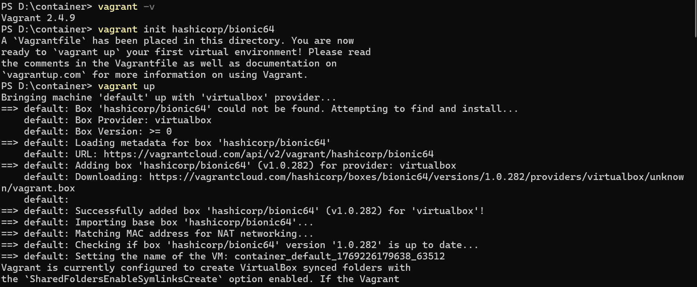
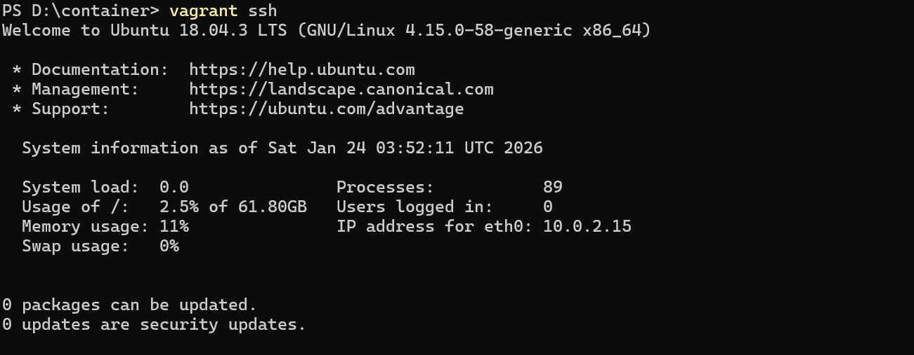

# Lab 1: Virtual Machines vs Containers - A Comparative Study

## Software and Hardware Requirements

### Hardware
- 64-bit system with virtualization support enabled in BIOS
- Minimum 8 GB RAM (4 GB minimum acceptable)
- Internet Connection

### Software (Windows Host)
- Oracle VirtualBox
- Vagrant
- Windows Subsystem for Linux (WSL 2)
- Ubuntu (WSL distribution)
- Docker Engine (docker.io)

## Theory

### Virtual Machine
A Virtual Machine emulates a complete physical computer, including its own operating system kernel, hardware drivers, and user space. Each VM runs on top of a hypervisor.

**Characteristics:**
- Full OS per VM
- Higher resource usage
- Strong isolation
- Slower startup time

### Container
Containers virtualize at the operating system level. They share the host OS kernel while isolating applications and dependencies in user space.

**Characteristics:**
- Shared kernel
- Lightweight
- Fast startup
- Efficient resource usage

## Part A: Install Vagrant and Automate VM

### 1. Install Oracle VM


### 2. Download Vagrant


### 3. Run Vagrant to Automate the VM


### 4. Run SSH into Vagrant


### 5. Perform Operations Inside VM


### 6. Halt the Vagrant


### 7. Destroy Vagrant


## **Experiment Setup – Part B: Containers using WSL (Windows)**

### **Step 1: Install WSL 2**

```powershell
wsl --install
```

Reboot the system after installation.

### **Step 2: Install Ubuntu on WSL**

```powershell
wsl --install -d Ubuntu
```
'''

### **Step 3: Install Docker Engine inside WSL**

```bash
sudo apt update
sudo apt install -y docker.io
sudo systemctl start docker
sudo usermod -aG docker $USER
```

Logout and login again to apply group changes.

```

Docker Version Check

```


---

### **Step 4: Run Ubuntu Container with Nginx**

```bash
docker pull ubuntu

docker run -d -p 8080:80 --name nginx-container nginx
```
Docker Pull and Run
```
```

Container Running Status
```

---

### **Step 5: Verify Nginx in Container**

```bash
curl localhost:8080
```
Nginx Verification in Container

`

---

## **Resource Utilization Observation**

### **VM Observation Commands**

```bash
free -h
htop
systemd-analyze
```
VM Resource Usage


VM Boot Time Analysis


---

### **Container Observation Commands**

```bash
docker stats
free -h
```
Container Resource Usage


Host System Resource Usage


---

### **Parameters to Compare and Observations**

| Parameter    | Virtual Machine | Container |
| ------------ | --------------- | --------- |
| Boot Time    | High            | Very Low  |
| RAM Usage    | High            | Low       |
| CPU Overhead | Higher          | Minimal   |
| Disk Usage   | Larger          | Smaller   |
| Isolation    | Strong          | Moderate  |

---

## **Result**

The experiment demonstrates that containers are significantly more lightweight and resource-efficient compared to virtual machines, while virtual machines provide stronger isolation and full OS-level abstraction.

Virtual Machine:

* Resource overhead: High
* Isolation: Strong

Container:

* Resource overhead: Minimal
* Isolation: Good

---

## **Conclusion**

Virtual Machines are suitable for full OS isolation and legacy workloads, whereas Containers are ideal for microservices, rapid deployment, and efficient resource utilization.

---
