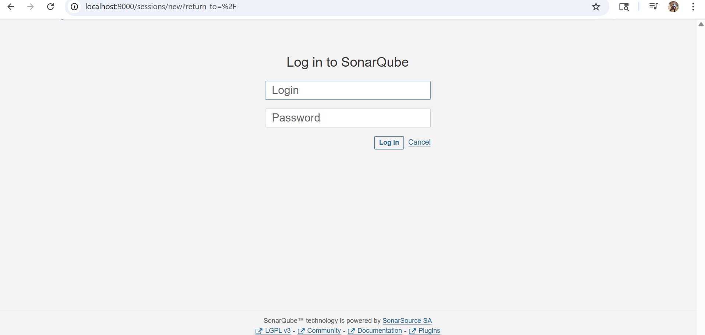
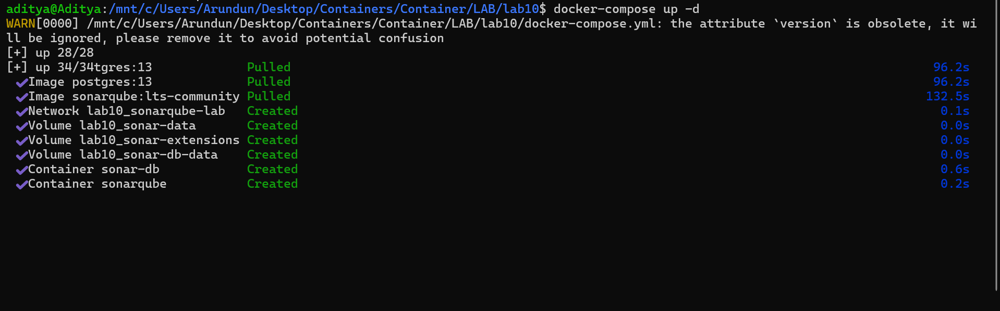
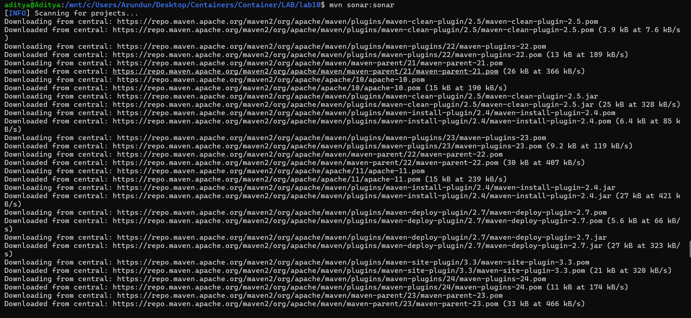
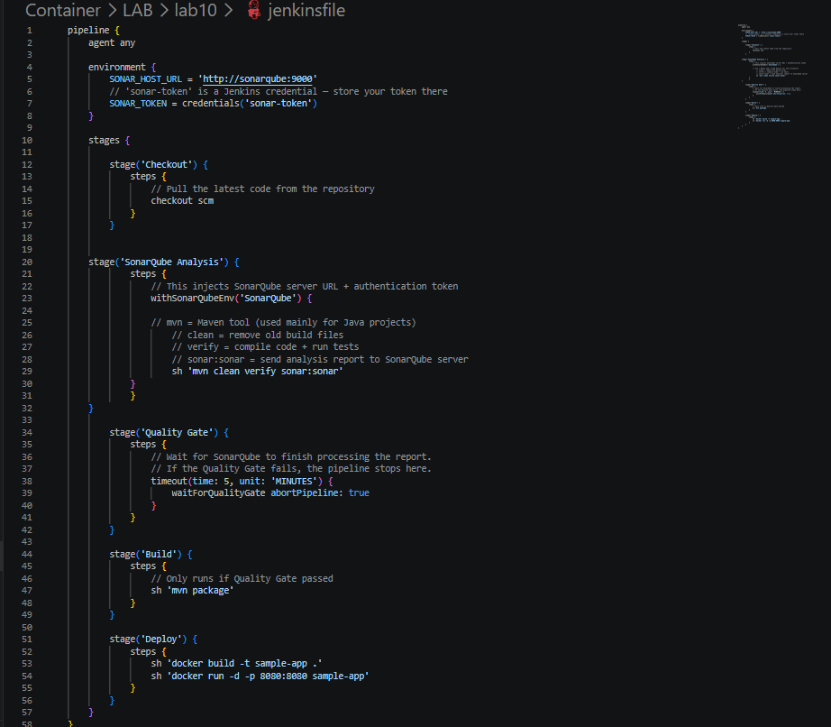
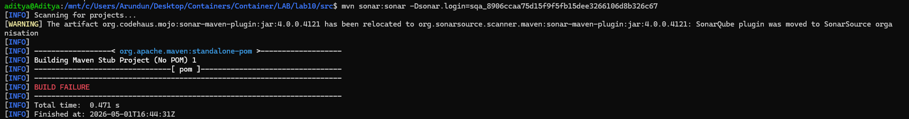

# Experiment 10: SonarQube — Static Code Analysis

This lab demonstrates how to set up and use **SonarQube** for automatic static code analysis to detect bugs, vulnerabilities, and code smells before deployment.

## Table of Contents

- [Overview](#overview)
- [Architecture](#architecture)
- [Prerequisites](#prerequisites)
- [Setup Instructions](#setup-instructions)
  - [Step 1: Start SonarQube Server](#step-1-start-sonarqube-server)
  - [Step 2: Create Sample Java App](#step-2-create-sample-java-app)
  - [Step 3: Generate Authentication Token](#step-3-generate-authentication-token)
  - [Step 4: Run the Scanner](#step-4-run-the-scanner)
  - [Step 5: View Dashboard Results](#step-5-view-dashboard-results)
  - [Step 6: Jenkins Integration (Optional)](#step-6-jenkins-integration-optional)
- [Commands Quick Reference](#commands-quick-reference)
- [Best Practices](#best-practices)
- [Troubleshooting](#troubleshooting)

## Overview

**SonarQube** is an open-source platform that automatically scans source code for:

- **Bugs** – code that will likely break or behave incorrectly
- **Vulnerabilities** – security weaknesses
- **Code Smells** – maintainability issues
- **Technical Debt** – estimated time to fix all issues

### Key Components

| Component | Role |
|-----------|------|
| **SonarQube Server** | Stores results, applies rules, shows dashboard (port 9000) |
| **Sonar Scanner** | Reads code, detects issues, sends report to server |
| **Quality Gate** | Pass/fail rules before deployment |

> Both Server and Scanner are **required** for a working pipeline.

## Architecture
Your Code → Sonar Scanner → SonarQube Server → PostgreSQL DB
│ │
└──(HTTP + Token)─┘

text

## Prerequisites

- Docker and Docker Compose
- Java 11+ (for sample app)
- Maven
- Modern web browser

## Setup Instructions

### Step 1: Start SonarQube Server







Create `docker-compose.yml`:

```yaml
version: '3.8'

services:
  sonar-db:
    image: postgres:13
    container_name: sonar-db
    environment:
      POSTGRES_USER: sonar
      POSTGRES_PASSWORD: sonar
      POSTGRES_DB: sonarqube
    volumes:
      - sonar-db-data:/var/lib/postgresql/data
    networks:
      - sonarqube-lab

  sonarqube:
    image: sonarqube:lts-community
    container_name: sonarqube
    ports:
      - "9000:9000"
    environment:
      SONAR_JDBC_URL: jdbc:postgresql://sonar-db:5432/sonarqube
      SONAR_JDBC_USERNAME: sonar
      SONAR_JDBC_PASSWORD: sonar
    volumes:
      - sonar-data:/opt/sonarqube/data
      - sonar-extensions:/opt/sonarqube/extensions
    depends_on:
      - sonar-db
    networks:
      - sonarqube-lab

volumes:
  sonar-db-data:
  sonar-data:
  sonar-extensions:

networks:
  sonarqube-lab:
    driver: bridge
Start the server:

bash
docker-compose up -d
docker-compose logs -f sonarqube   # Wait for "SonarQube is up"
Open http://localhost:9000 → Login: admin / admin (change password on first login)

Step 2: Create Sample Java App
bash
mkdir -p sample-java-app/src/main/java/com/example
cd sample-java-app
Create src/main/java/com/example/Calculator.java with intentional issues (division by zero, SQL injection risk, null pointer risk, empty catch block, duplicated code).

Create pom.xml:

xml
<?xml version="1.0" encoding="UTF-8"?>
<project ...>
  <modelVersion>4.0.0</modelVersion>
  <groupId>com.example</groupId>
  <artifactId>sample-app</artifactId>
  <version>1.0-SNAPSHOT</version>

  <properties>
    <maven.compiler.source>11</maven.compiler.source>
    <maven.compiler.target>11</maven.compiler.target>
    <sonar.projectKey>sample-java-app</sonar.projectKey>
    <sonar.host.url>http://localhost:9000</sonar.host.url>
    <!-- Replace with actual token -->
    <sonar.login>YOUR_TOKEN_HERE</sonar.login>
  </properties>

  <dependencies>
    <dependency>
      <groupId>junit</groupId>
      <artifactId>junit</artifactId>
      <version>4.13.2</version>
      <scope>test</scope>
    </dependency>
  </dependencies>

  <build>
    <plugins>
      <plugin>
        <groupId>org.sonarsource.scanner.maven</groupId>
        <artifactId>sonar-maven-plugin</artifactId>
        <version>3.9.1.2184</version>
      </plugin>
    </plugins>
  </build>
</project>
Step 3: Generate Authentication Token
Go to http://localhost:9000

Log in as admin

Click user icon (top right) → My Account → Security tab

Under Generate Tokens, type scanner-token

Click Generate

Copy the token immediately – it looks like sqp_xxxxxxxxxxxxxxxx

⚠️ The token is shown only once. Store it safely.

Step 4: Run the Scanner
Run the scanner using Docker:

bash
# Find the correct network name
docker inspect sonarqube | grep -i network

# Run scan (replace NETWORK_NAME and YOUR_TOKEN)
docker run --rm \
  --network NETWORK_NAME \
  -e SONAR_TOKEN="YOUR_TOKEN" \
  -v "$(pwd):/usr/src" \
  sonarsource/sonar-scanner-cli \
  -Dsonar.host.url=http://sonarqube:9000 \
  -Dsonar.projectBaseDir=/usr/src \
  -Dsonar.projectKey=sample-java-app
Alternative – using Maven directly:

bash
mvn sonar:sonar -Dsonar.login=YOUR_TOKEN
Step 5: View Dashboard Results
Open: http://localhost:9000/dashboard?id=sample-java-app

Expected output:

text
┌─────────────────────────────────────────────┐
│ Bugs: 5  │ Vulnerabilities: 1 │ Code Smells: 8 │
│ Coverage: 0%  │ Duplications: 2 blocks        │
│ Technical Debt: ~1h 30min                    │
│ Quality Gate: ✗ FAILED                       │
└─────────────────────────────────────────────┘
Query results via API:

bash
curl -u admin:YOUR_TOKEN \
  "http://localhost:9000/api/issues/search?projectKeys=sample-java-app&types=BUG"
Step 6: Jenkins Integration (Optional)
Add to your Jenkinsfile:

groovy
pipeline {
    agent any
    stages {
        stage('Checkout') {
            steps { git '...' }
        }
        stage('SonarQube Scan') {
            steps {
                withSonarQubeEnv('SonarQube') {
                    sh 'mvn sonar:sonar'
                }
            }
        }
        stage('Quality Gate') {
            steps {
                waitForQualityGate abortPipeline: true
            }
        }
        stage('Build & Deploy') {
            steps { sh 'mvn package' }
        }
    }
}
Commands Quick Reference
bash
# Start SonarQube server
docker-compose up -d

# Run scan with Maven
mvn sonar:sonar -Dsonar.login=YOUR_TOKEN

# Run scan with Docker CLI scanner
docker run --rm --network sonarqube-lab -e SONAR_TOKEN="token" \
  -v "$(pwd):/usr/src" sonarsource/sonar-scanner-cli \
  -Dsonar.host.url=http://sonarqube:9000 \
  -Dsonar.projectBaseDir=/usr/src \
  -Dsonar.projectKey=sample-java-app

# Query API for bugs
curl -u admin:YOUR_TOKEN \
  "http://localhost:9000/api/issues/search?projectKeys=myapp&types=BUG"

# Start Jenkins container
docker run -d -p 8080:8080 -v jenkins-data:/var/jenkins_home jenkins/jenkins:lts
Best Practices
Security
Never hardcode tokens – use environment variables or secrets manager

Use HTTPS for SonarQube in production

Apply least-privilege to scanner tokens

Code Quality
Set Quality Gates to block merges when coverage drops below 80%

Scan on every pull request, not just nightly

Fix issues as they appear – don't let technical debt accumulate

CI/CD Optimization
Cache dependencies between builds

Run SonarQube analysis in parallel with unit tests

Configure pipeline to fail fast on Quality Gate failures

Troubleshooting
Issue	Solution
Token not working	Regenerate token in UI and update sonar.login
Scanner can't connect to server	Ensure both containers are on same Docker network
Quality Gate fails	Review issues in dashboard and fix critical ones
Coverage 0%	Add unit tests and configure test report paths
Summary: SonarQube Server stores/display results, Scanner analyzes code, Token authenticates communication, Quality Gates block bad code from deployment. Both components are required.