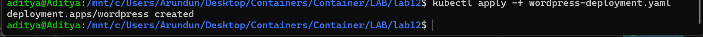
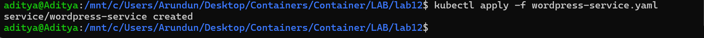
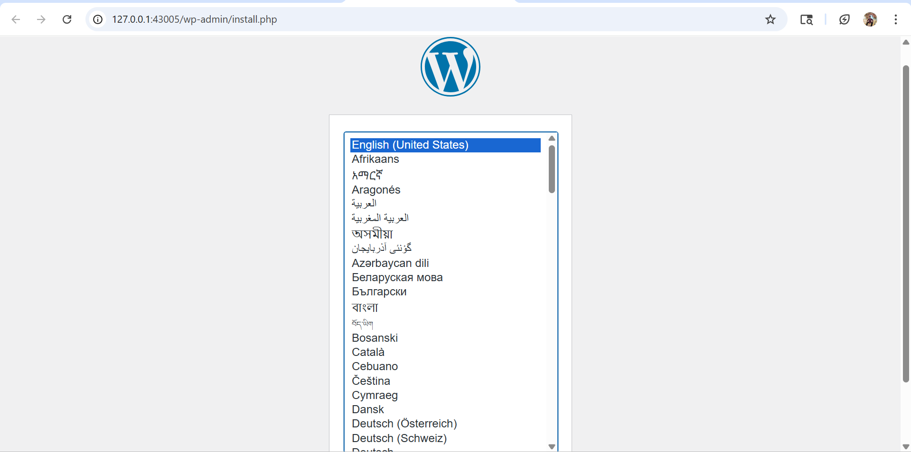
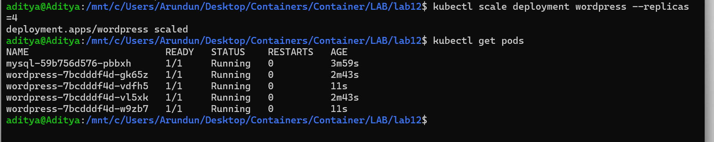
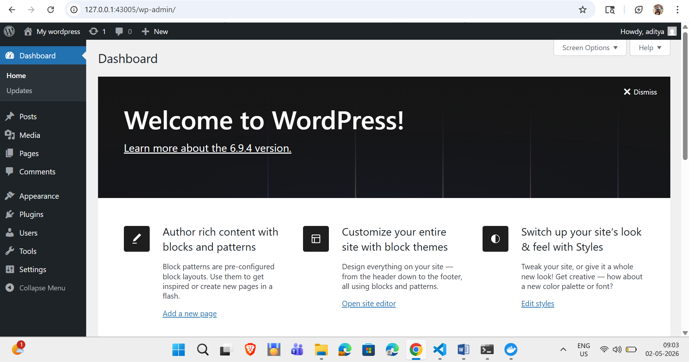
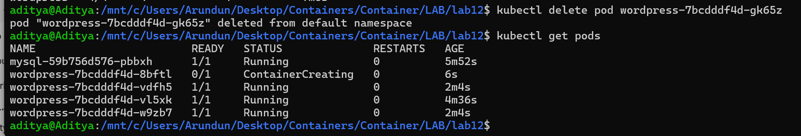

# Lab 12: Study and Analyse Container Orchestration using Kubernetes

## Objective

Learn why Kubernetes is used, its basic concepts, and how to deploy, scale, and fix applications using Kubernetes commands.

## Why Kubernetes over Docker Swarm?

| Reason | Explanation |
|--------|-------------|
| Industry standard | Most companies use Kubernetes |
| Powerful scheduling | Automatically decides where to run your app |
| Large ecosystem | Many tools and plugins available |
| Cloud-native support | Works on AWS, Google Cloud, Azure, etc. |

## Core Kubernetes Concepts

| Docker Concept | Kubernetes Equivalent | What it means |
|----------------|----------------------|----------------|
| Container | **Pod** | A group of one or more containers; smallest unit in K8s |
| Compose service | **Deployment** | Describes how your app should run (e.g., 2 copies, which image to use) |
| Load balancing | **Service** | Exposes your app to the outside world or other pods |
| Scaling | **ReplicaSet** | Ensures a certain number of pod copies are always running |

## Hands-On Lab (Using k3d or Minikube)

> **Note:** You need `kubectl` and a cluster (k3d or Minikube) installed.

### Task 1: Create a Deployment



Create `wordpress-deployment.yaml`:

```yaml
apiVersion: apps/v1
kind: Deployment
metadata:
  name: wordpress
spec:
  replicas: 2
  selector:
    matchLabels:
      app: wordpress
  template:
    metadata:
      labels:
        app: wordpress
    spec:
      containers:
      - name: wordpress
        image: wordpress:latest
        ports:
        - containerPort: 80


Apply the deployment:

bash
kubectl apply -f wordpress-deployment.yaml
Task 2: Expose the Deployment as a Service
Create wordpress-service.yaml:

yaml
apiVersion: v1
kind: Service
metadata:
  name: wordpress-service
spec:
  type: NodePort
  selector:
    app: wordpress
  ports:
    - port: 80
      targetPort: 80
      nodePort: 30007
Apply the service:

bash
kubectl apply -f wordpress-service.yaml
Task 3: Verify Everything
bash
kubectl get pods
kubectl get svc
Access WordPress in your browser: http://<node-ip>:30007

Minikube: minikube ip

k3d: Usually localhost


Task 4: Scale the Deployment
bash
kubectl scale deployment wordpress --replicas=4
kubectl get pods
Task 5: Self-Healing Demonstration
bash
kubectl get pods
kubectl delete pod <pod-name>
kubectl get pods   # Pod will be automatically recreated
Swarm vs Kubernetes Comparison
Feature	Docker Swarm	Kubernetes
Setup	Very easy	More complex
Scaling	Basic	Advanced (auto-scaling)
Ecosystem	Small	Huge
Industry use	Rare	Standard
Verdict: Learn Kubernetes — it's what companies use.

Advanced Lab: Real Cluster with kubeadm
Requirements
2-3 VMs (VirtualBox, VMware)

Ubuntu 22.04 or 24.04

Each VM: 2+ CPU, 2+ GB RAM

Setup Steps
Install kubeadm, kubelet, kubectl on all nodes

bash
sudo apt update
sudo apt install -y apt-transport-https ca-certificates curl
curl -fsSL https://pkgs.k8s.io/core:/stable:/v1.29/deb/Release.key | sudo gpg --dearmor -o /etc/apt/keyrings/kubernetes-apt-keyring.gpg
echo 'deb [signed-by=/etc/apt/keyrings/kubernetes-apt-keyring.gpg] https://pkgs.k8s.io/core:/stable:/v1.29/deb/ /' | sudo tee /etc/apt/sources.list.d/kubernetes.list
sudo apt update
sudo apt install -y kubeadm kubelet kubectl
sudo apt-mark hold kubeadm kubelet kubectl
Initialize control plane (master node)

bash
sudo kubeadm init
Set up kubeconfig

bash
mkdir -p $HOME/.kube
sudo cp /etc/kubernetes/admin.conf $HOME/.kube/config
sudo chown $(id -u):$(id -g) $HOME/.kube/config
Install network plugin (Calico)

bash
kubectl apply -f https://docs.projectcalico.org/manifests/calico.yaml
Join worker nodes — use the join command from kubeadm init

Verify cluster






bash
kubectl get nodes
When to Use Which Tool
Tool	Best for
k3d	Quick learning on your laptop
Minikube	Single-node cluster testing
kubeadm	Real, production-style cluster
Cheat Sheet
Goal	Command
Apply a YAML file	kubectl apply -f file.yaml
See all pods	kubectl get pods
See all services	kubectl get svc
Scale a deployment	kubectl scale deployment <name> --replicas=N
Delete a pod	kubectl delete pod <pod-name>
See all nodes	kubectl get nodes
Summary
You have now:

Understood basic Kubernetes concepts

Deployed WordPress using a Deployment and Service

Scaled and tested self-healing

Learned how to build a real cluster with kubeadm