# 🐳 Lab 5: Docker Volumes, Environment Variables & Networks


This experiment covers:
- Docker Volumes (Persistent Storage)
- Environment Variables
- Monitoring & Networks

---

## 📁 Project Structure

lab5/
│── 2nd/
│── images/
│   ├── 1.png → 17.png
│── README.md

---

# 🔹 Part 1: Docker Volumes – Persistent Data Storage

## 🧠 Understanding Data Persistence

### ❗ Problem: Container Data is Ephemeral  
Data inside a container is lost when the container is removed.

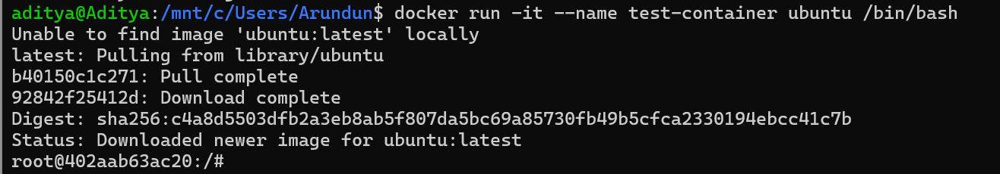

---

## 🔹 Create Container & Write Data

```bash
docker run -dit --name test-container ubuntu
docker exec -it test-container bash
```

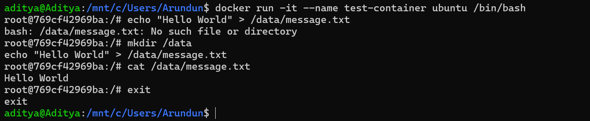

---

## 🔹 Verify Data Inside Container

```bash
docker exec test-container cat /data/message.txt
```

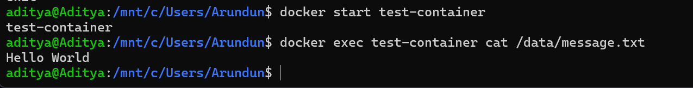

---

# 🔹 Volume Types

## 1️⃣ Anonymous Volumes

```bash
docker run -v /data ubuntu
```

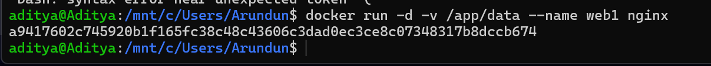

---

## 2️⃣ Named Volumes

```bash
docker volume create myvolume
docker run -v myvolume:/data ubuntu
```


---

## 3️⃣ Bind Mounts (Host Directory)

```bash
mkdir myfolder
docker run -v $(pwd)/myfolder:/data ubuntu
```

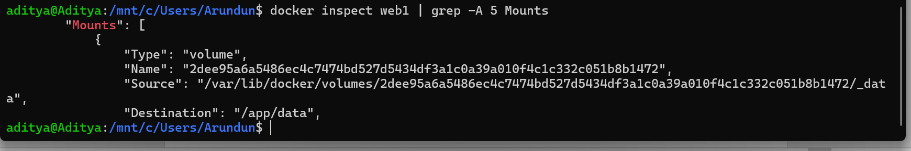

---

## 🔹 Data Persistence Check

```bash
docker stop test-container
docker start test-container
```


---

# 🔹 Practical Example: Database Storage

MySQL with Named Volume ensures data persists.

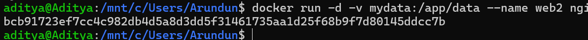

---

# 🔹 Volume Management Commands

```bash
docker volume ls
docker volume create myvolume
docker volume inspect myvolume
docker volume prune
```


---

# 🔹 Part 2: Environment Variables

## 🔹 Using -e Flag

```bash
docker run -e NAME=Aditya ubuntu env
```

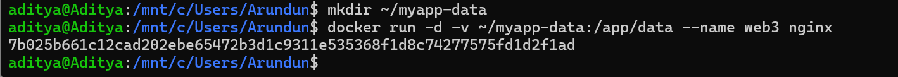

---

## 🔹 Using Env File

```bash
docker run --env-file .env ubuntu
```


---

## 🔹 Python Example

```python
import os
print(os.getenv("NAME"))
```

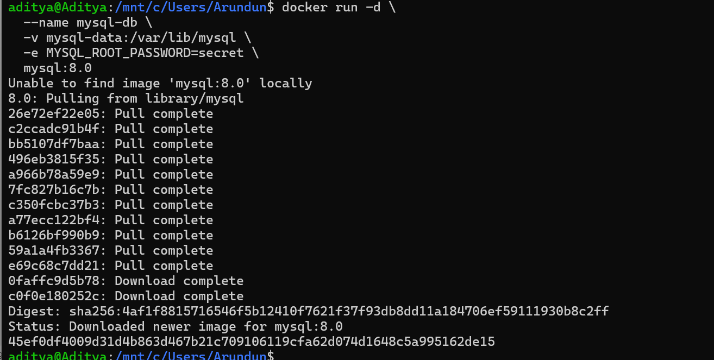

---

## 🔹 Test Environment Variables

```bash
docker exec test-container env
```


---

# 🔹 Part 3: Monitoring & Networks

## 🔹 Check Containers

```bash
docker ps
```

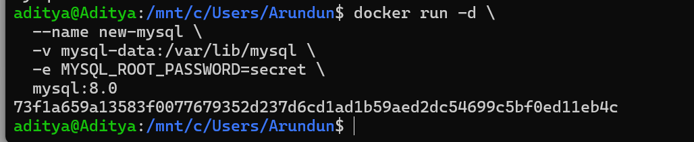

---

## 🔹 List Networks

```bash
docker network ls
```

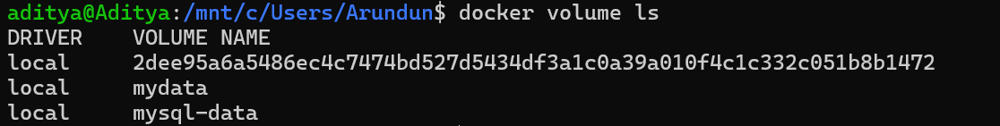

---

## 🔹 Create Network

```bash
docker network create mynetwork
```

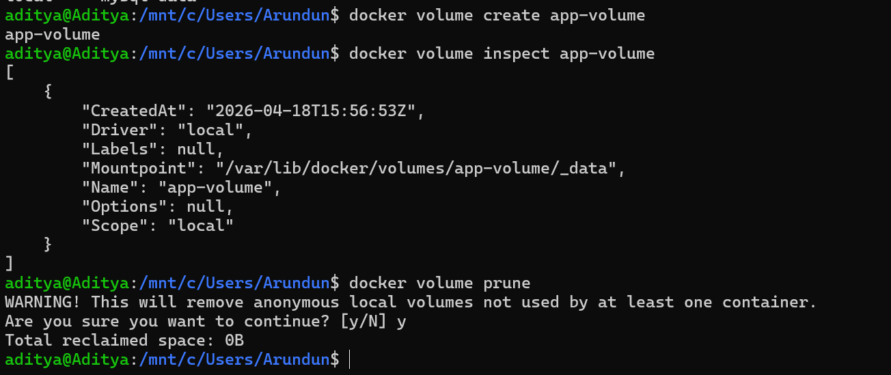

---

## 🔹 Connect Container

```bash
docker network connect mynetwork test-container
```

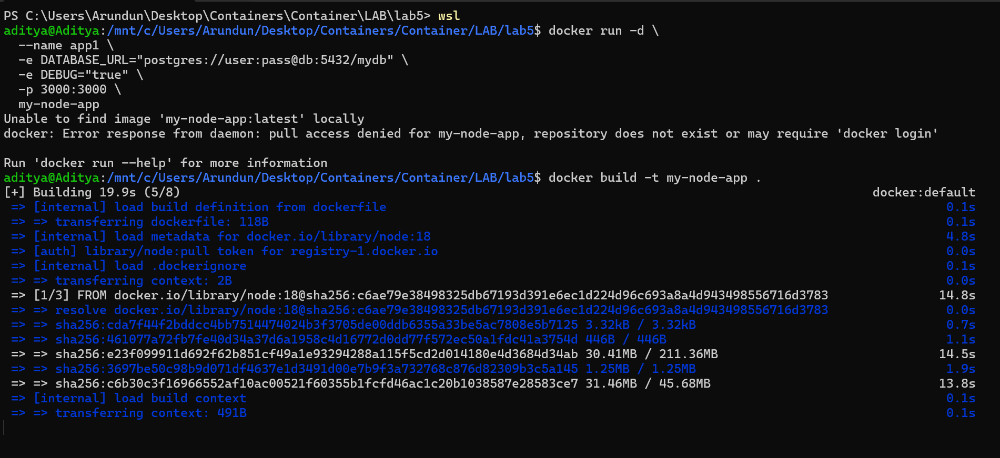
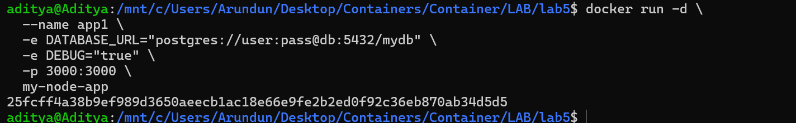

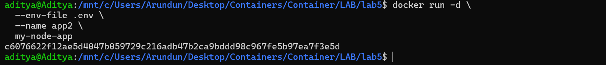
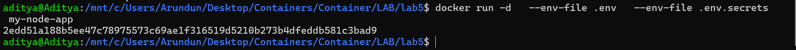
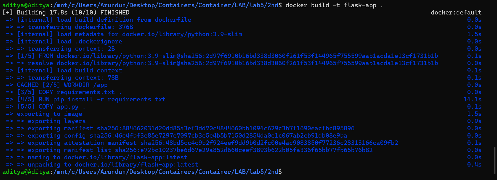
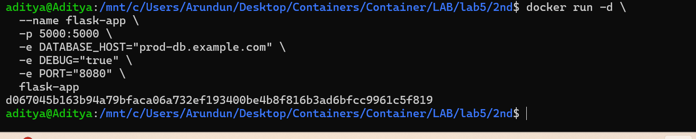
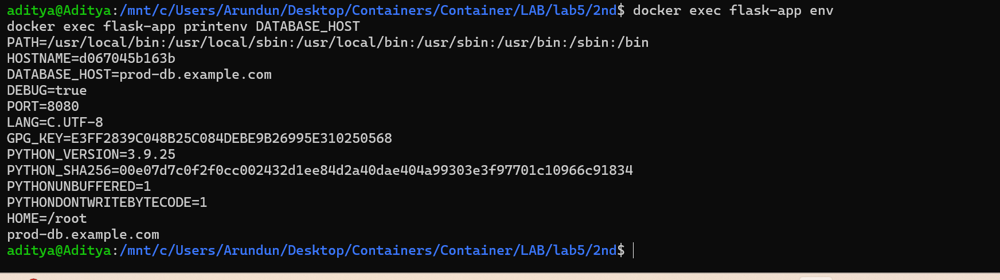
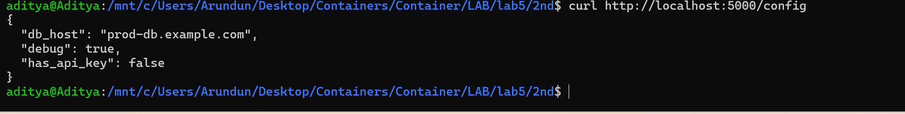

---

# ✅ Conclusion

- Docker volumes ensure data persistence  
- Environment variables allow flexible configuration  
- Networks enable container communication  
