# 🐳 Lab 6: Docker Run vs Docker Compose

## 📌 Experiment 6

### Title:
Comparison of Docker Run and Docker Compose

---

# 🔹 PART A – THEORY

## 🎯 Objective
To understand the relationship between `docker run` and Docker Compose and compare their syntax and use cases.

---

## 🧠 Docker Run (Imperative Approach)

- Uses command-line flags
- Step-by-step execution

### Example:
```bash
docker run -d \
  --name my-nginx \
  -p 8080:80 \
  -v ./html:/usr/share/nginx/html \
  -e NGINX_HOST=localhost \
  --restart unless-stopped \
  nginx:alpine
```

---

## 🧠 Docker Compose (Declarative Approach)

- Uses `docker-compose.yml`
- Defines desired state

### Run command:
```bash
docker compose up -d
```

### Example:
```yaml
version: '3.8'

services:
  nginx:
    image: nginx:alpine
    container_name: my-nginx
    ports:
      - "8080:80"
    volumes:
      - ./html:/usr/share/nginx/html
    environment:
      NGINX_HOST: localhost
    restart: unless-stopped
```

---

## 🔄 Mapping: Docker Run vs Compose

| Docker Run | Docker Compose |
|------------|---------------|
| -p         | ports         |
| -v         | volumes       |
| -e         | environment   |
| --name     | container_name|
| --network  | networks      |
| --restart  | restart       |

---

## ✅ Advantages of Docker Compose

- Easy multi-container setup
- Version controlled
- Scalable
- Single command deployment

---

# 🔹 PART B – PRACTICAL

## 🧪 Task 1: Single Container

### Using Docker Run
```bash
docker run -d -p 8081:80 nginx

```
```
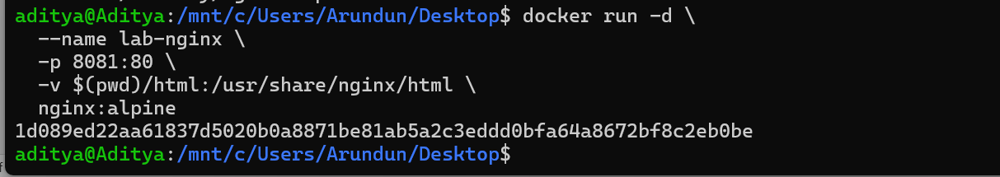
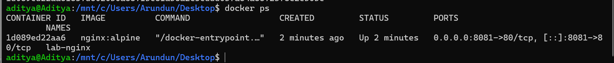


```
Access: http://localhost:8081

---


### Using Docker Compose

```yaml
version: '3.8'
services:
  nginx:
    image: nginx
    ports:
      - "8081:80"
```

Run:
```bash
docker compose up -d
```
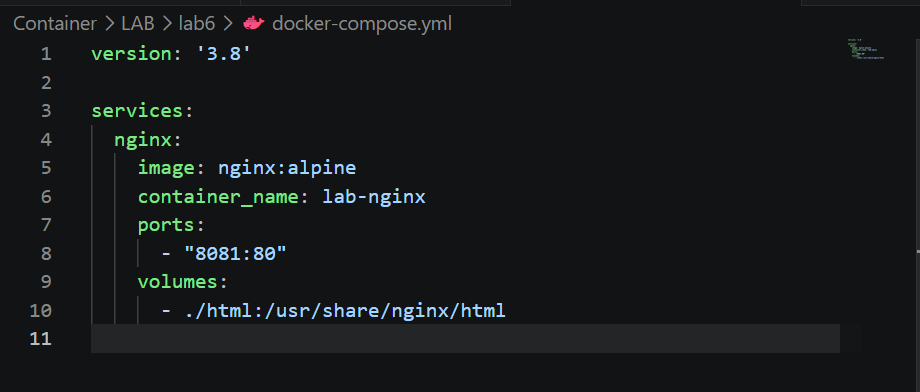

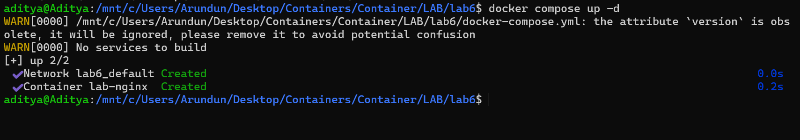

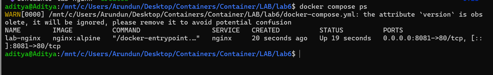

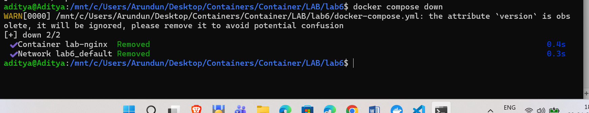


---

## 🧪 Task 2: Multi-Container App (WordPress + MySQL)

### Using Docker Run

```bash
docker network create wp-net

docker run -d --name mysql \
  --network wp-net \
  -e MYSQL_ROOT_PASSWORD=secret \
  mysql:5.7

  


docker run -d --name wordpress \
  --network wp-net \
  -p 8082:80 \
  -e WORDPRESS_DB_HOST=mysql \
  -e WORDPRESS_DB_PASSWORD=secret \
  wordpress:latest
```
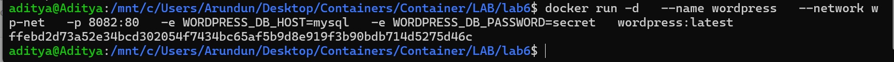

Access: http://localhost:8082

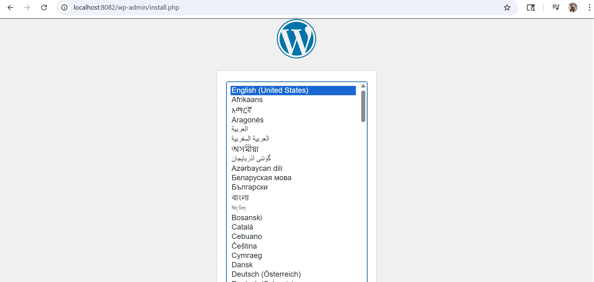

---

### Using Docker Compose

```yaml
version: '3.8'

services:
  mysql:
    image: mysql:5.7
    environment:
      MYSQL_ROOT_PASSWORD: secret
      MYSQL_DATABASE: wordpress
    volumes:
      - mysql_data:/var/lib/mysql

  wordpress:
    image: wordpress:latest
    ports:
      - "8082:80"
    environment:
      WORDPRESS_DB_HOST: mysql
      WORDPRESS_DB_PASSWORD: secret
    depends_on:
      - mysql

volumes:
  mysql_data:
```
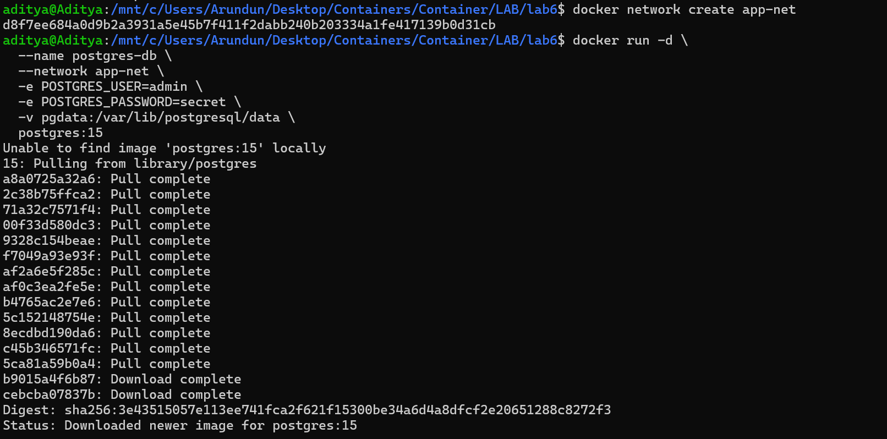
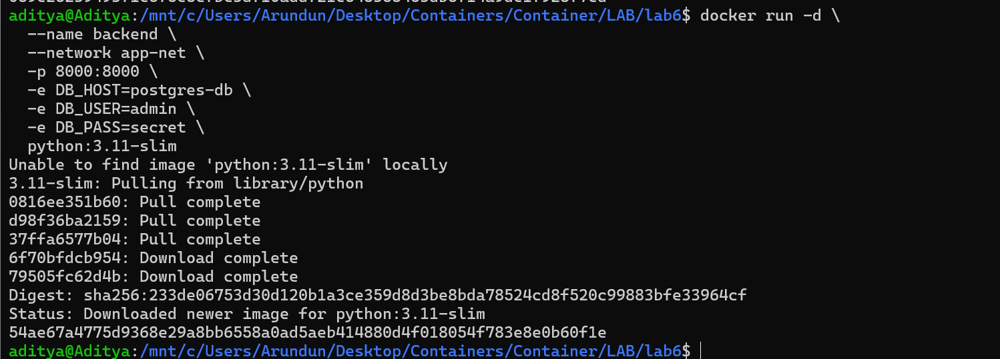
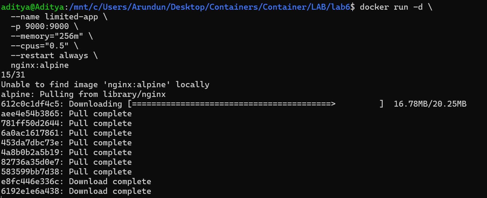


Run:
```bash
docker compose up -d
```

Stop:
```bash
docker compose down -v
```

---

# 🔹 PART C – CONVERSION TASKS

## 🧩 Example Conversion

### Docker Run:
```bash
docker run -d --name webapp -p 5000:5000 -e APP_ENV=production node:18-alpine
```

### Compose:
```yaml
version: '3.8'
services:
  webapp:
    image: node:18-alpine
    container_name: webapp
    ports:
      - "5000:5000"
    environment:
      APP_ENV: production
    restart: unless-stopped
```

---

# 🔹 PART D – DOCKERFILE USAGE

```dockerfile
FROM node:18-alpine
WORKDIR /app
COPY . .
RUN npm install
CMD ["npm", "start"]
```

---

# 🔹 SCALING

```bash
docker compose up --scale wordpress=3
```

---

# 🔹 DOCKER SWARM

```bash
docker swarm init
docker stack deploy -c docker-compose.yml wpstack
docker service scale wpstack_wordpress=3
```

---

# ✅ Conclusion

- docker run is imperative  
- Docker Compose is declarative  
- Compose simplifies multi-container apps  
- Swarm enables scaling and orchestration  
