# 🚀 Lab 7: CI/CD using Jenkins, GitHub & Docker Hub

## 📌 Aim
To design and implement a complete CI/CD pipeline using Jenkins, integrating:
- GitHub (source code)
- Docker (build)
- Docker Hub (deployment)

---

## My Jenkins Repository 

[my-app](https://github.com/Aditya12155/my-app)

## 🎯 Objectives
- Understand CI/CD workflow using Jenkins  
- Create GitHub repo with app + Jenkinsfile  
- Build Docker images from source  
- Store Docker Hub credentials securely  
- Automate build & push using webhooks  
- Use same host as Jenkins agent  

---

# 🧠 Theory

## 🔹 What is Jenkins?
Jenkins is a web-based automation server used for:
- Build
- Test
- Deploy applications  

---

## 🔹 What is CI/CD?

### Continuous Integration (CI)
Code builds automatically after each commit  

### Continuous Deployment (CD)
Artifacts are deployed automatically  

---

## 🔄 Workflow

Developer → GitHub → Webhook → Jenkins → Build → Docker Hub

---

# ⚙️ Prerequisites
- Docker & Docker Compose  
- GitHub Account  
- Docker Hub Account  
- Basic Linux knowledge  

---

# 🔹 Part A: GitHub Setup

## 📁 Repository Structure

my-app/
├── app.py
├── requirements.txt
├── Dockerfile
├── Jenkinsfile

---

## 🧾 Application Code

```python
from flask import Flask
app = Flask(__name__)

@app.route("/")
def home():
    return "Hello from CI/CD Pipeline!"

app.run(host="0.0.0.0", port=80)
```

---

## 📦 requirements.txt

flask

---

## 🐳 Dockerfile

```dockerfile
FROM python:3.10-slim
WORKDIR /app
COPY . .
RUN pip install -r requirements.txt
EXPOSE 80
CMD ["python", "app.py"]
```

---

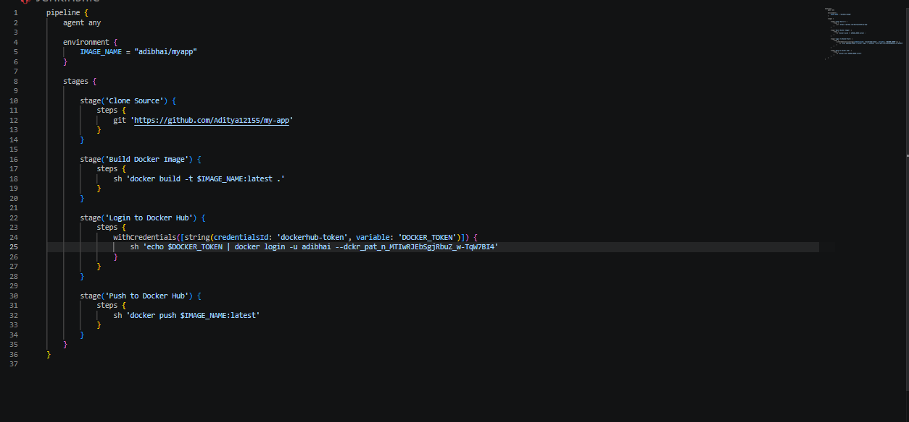

# 🔹 Jenkins Setup

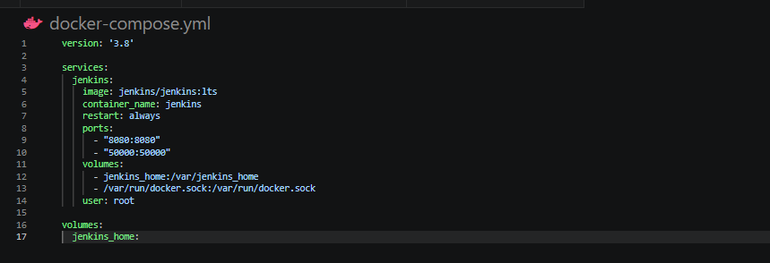
```bash
docker compose up -d
```

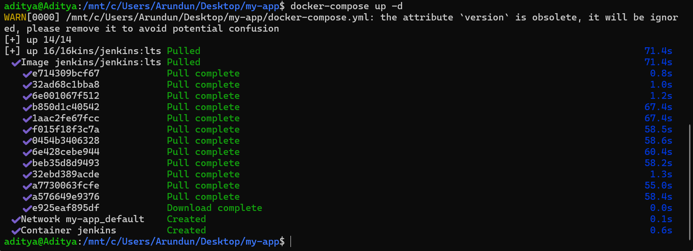

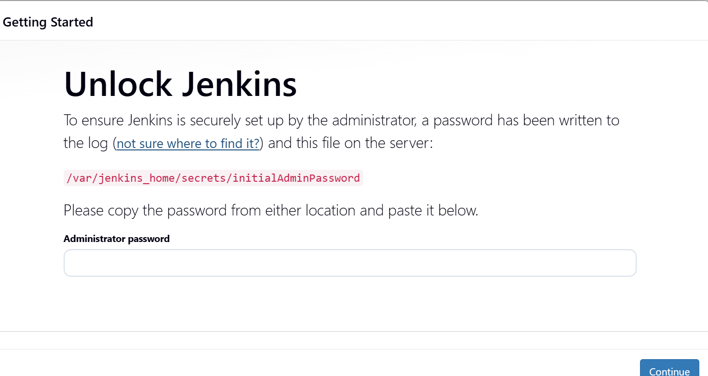

Access: http://localhost:8080

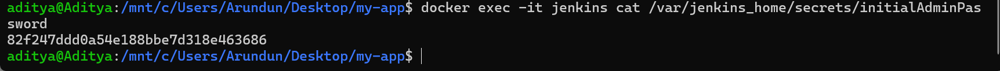

Unlock:
```bash
docker exec -it jenkins cat /var/jenkins_home/secrets/initialAdminPassword
```
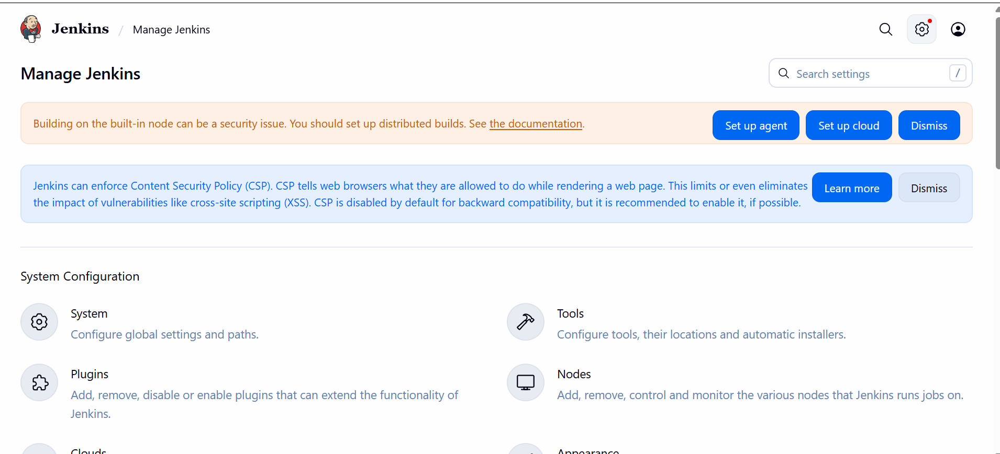
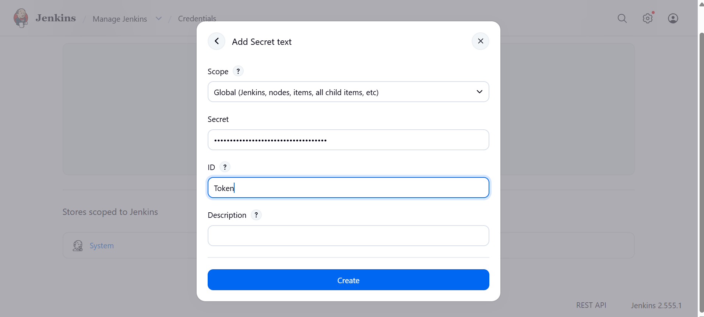

---

# 🔹 Jenkins Configuration
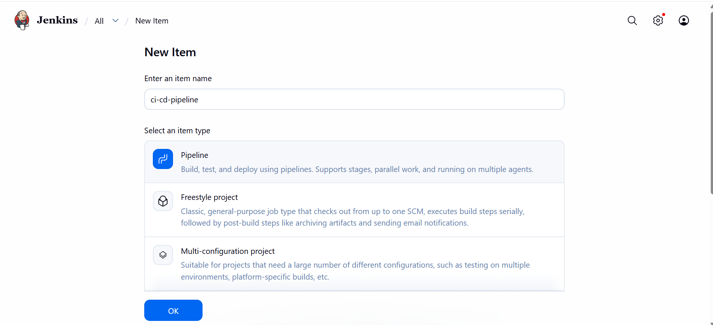
Add Docker Hub Credentials:
- ID: dockerhub-token

Create Pipeline Job:
- Name: ci-cd-pipeline
- Use Jenkinsfile from GitHub

---
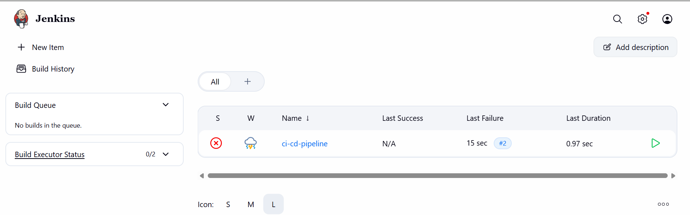


# 🔹 GitHub Webhook

Payload URL:
http://<your-server-ip>:8080/github-webhook/

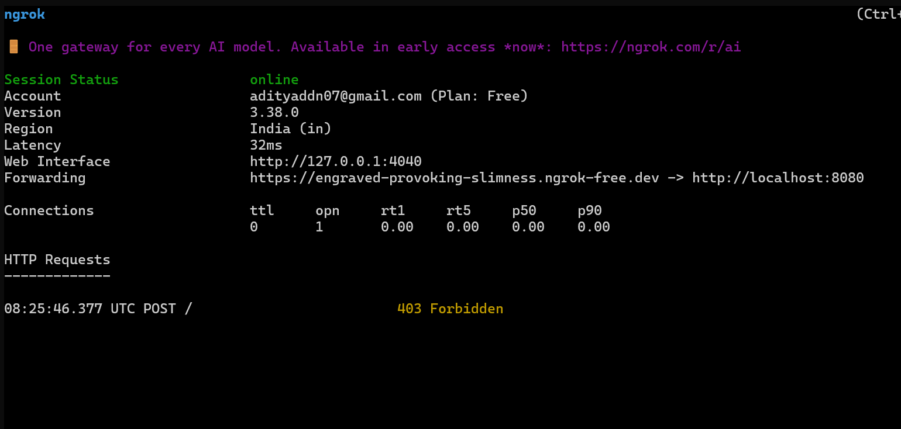

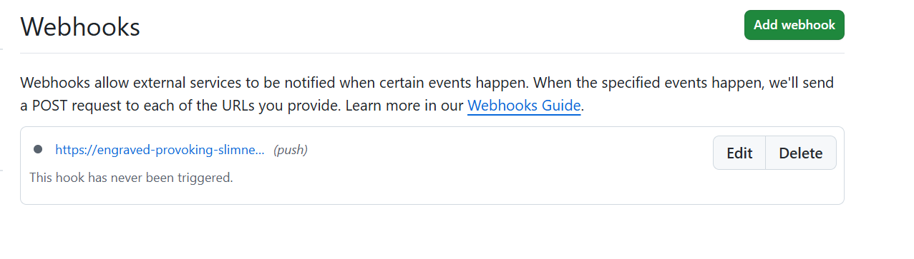
Event: Push

---

# 🔹 Execution Flow

1. Code Push → GitHub  
2. Webhook → Jenkins  
3. Jenkins Pipeline:
   - Clone
   - Build
   - Auth
   - Push  
4. Image available on Docker Hub  

---

# 🔹 Same Host Agent

Docker socket:
```
/var/run/docker.sock
```

Jenkins directly controls Docker.

---

# 📊 Observations
- Jenkins simplifies CI/CD  
- GitHub manages code  
- Docker ensures consistency  
- Webhooks automate process  

---

# ✅ Result
CI/CD pipeline successfully implemented.
