# 🐳 Lab 9 – Ansible Automation with Docker

## 📖 Experiment 9: Ansible

---

## 🎯 Objective

- Understand Ansible architecture
- Automate server configuration using playbooks
- Use Docker containers as managed nodes
- Perform configuration tasks across multiple servers

---

## ⚠️ Problem Statement

Managing infrastructure manually across multiple servers leads to:

- Configuration drift  
- Inconsistent environments  
- Time-consuming repetitive tasks  
- Poor scalability  

---

## 💡 What is Ansible?

- Open-source automation tool
- Uses YAML-based playbooks
- Agentless (uses SSH)

---

## 🚀 Key Features

- Agentless
- Idempotent
- Declarative syntax
- Push-based execution

---

# ⚙️ Installation

```bash
pip install ansible
ansible --version
```

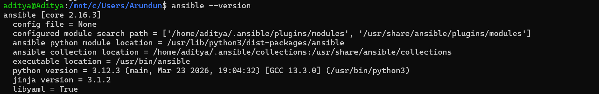

---

# 🐳 Docker SSH Server Setup

## Generate SSH Key

```bash
ssh-keygen -t rsa -b 4096
```

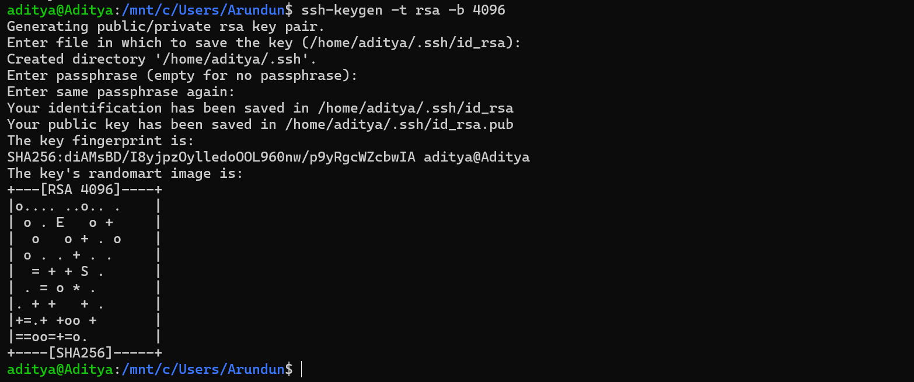

---

## Build Docker Image

```bash
docker build -t ubuntu-server .
```

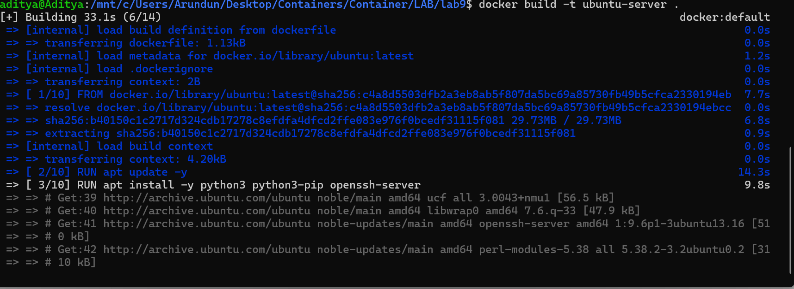

---

## Run Container

```bash
docker run -d -p 2222:22 --name ssh-server ubuntu-server
```

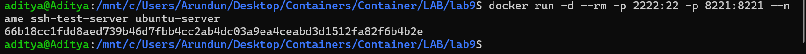

---

## Test SSH

```bash
ssh -i ~/.ssh/id_rsa root@localhost -p 2222
```

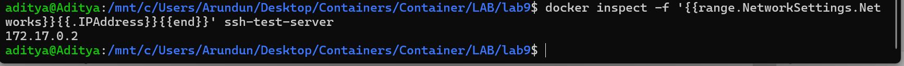

---

# 🖥️ Multiple Servers

```bash
for i in {1..4}; do
  docker run -d -p 220${i}:22 --name server${i} ubuntu-server
done
```

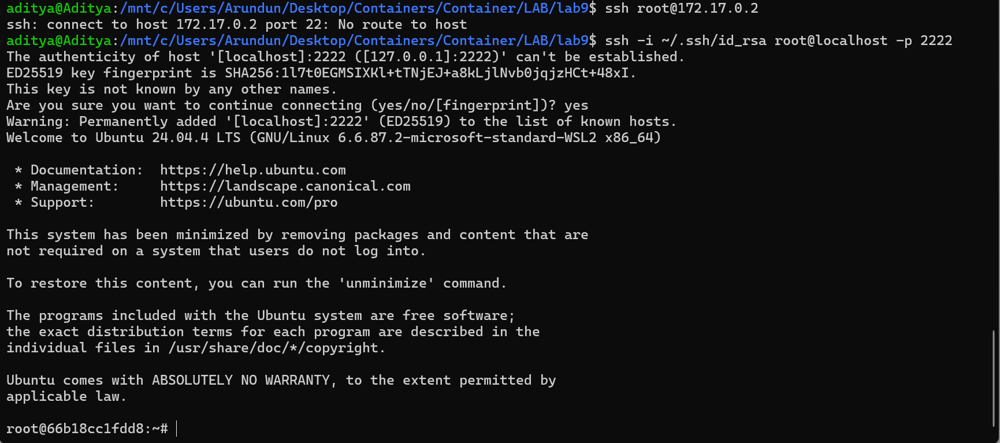

---

# 📂 Inventory

```bash
echo "[servers]" > inventory.ini
```

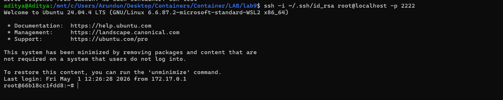

---

# 🔌 Test Connectivity

```bash
ansible all -i inventory.ini -m ping
```

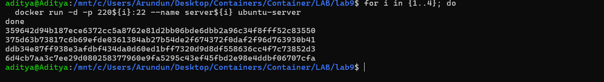

---

# 📜 Playbook

```yaml
---
- name: Configure servers
  hosts: all
  become: yes
  tasks:
    - name: Install packages
      apt:
        name: ["vim","htop","wget"]
        state: present
```

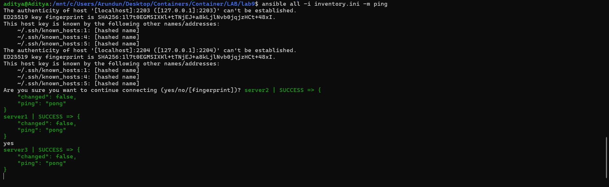

---

# ▶️ Run Playbook

```bash
ansible-playbook -i inventory.ini playbook1.yml
```

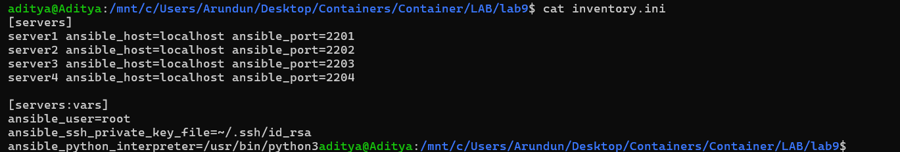

---

# ✅ Verification

```bash
ansible all -i inventory.ini -m command -a "cat /root/ansible_test.txt"
```

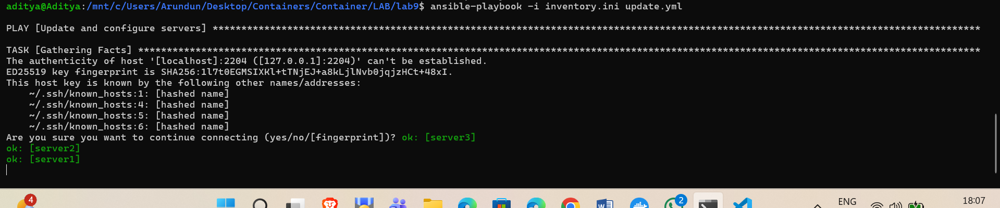

---

# 🧹 Cleanup

```bash
for i in {1..4}; do docker rm -f server${i}; done
```

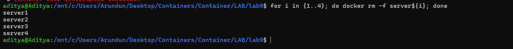

---

# 🏁 Conclusion

- Ansible automates server management efficiently  
- Docker provides lightweight testing servers  
- Combination is powerful for DevOps workflows  

---

## 👨‍💻 Author

Aditya Sharma
Roll No: 500122015
