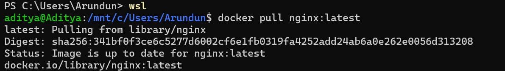
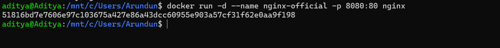
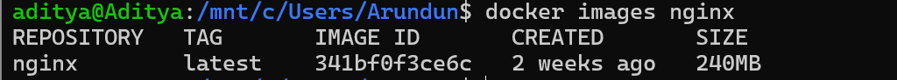
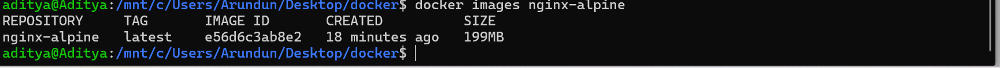
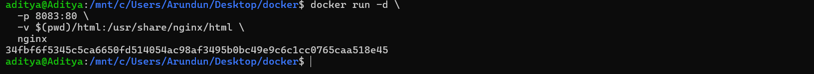

# 🐳 Lab 3 – Deploy NGINX Using Different Base Images & Compare Image Layers

## 📖 Experiment 3
This experiment demonstrates how to deploy **NGINX** using Official, Ubuntu, and Alpine images and compare their size, layers, and performance.

---

## 🎯 Objective
- Deploy NGINX using different base images
- Build custom Docker images
- Compare image layers and size
- Perform functional tasks using NGINX

---

## 🛠️ Prerequisites
Docker installed and running.

```bash
docker --version
```

---

# 🚀 Part 1: Deploy NGINX Using Official Image

### Pull Image
```bash
docker pull nginx:latest
```


### Run Container
```bash
docker run -d --name nginx-official -p 8080:80 nginx
```


### Verify
```bash
curl http://localhost:8080
```


### Image Check
```bash
docker images nginx
```


---

# 🧱 Part 2: Custom NGINX Using Ubuntu Base Image

### Build Image
```bash
docker build -t nginx-ubuntu .
```


### Run Container
```bash
docker run -d --name nginx-ubuntu -p 8081:80 nginx-ubuntu
```


### Image Size
```bash
docker images nginx-ubuntu
```


---

# 🏔️ Part 3: Custom NGINX Using Alpine Base Image

### Build Image
```bash
docker build -t nginx-alpine .
```


### Run Container
```bash
docker run -d --name nginx-alpine -p 8082:80 nginx-alpine
```


### Image Size
```bash
docker images nginx-alpine
```


---

# 📊 Part 4: Image Size & Layer Comparison

### Compare Images
```bash
docker images | grep nginx
```


### Inspect Layers
```bash
docker history nginx
docker history nginx-ubuntu
docker history nginx-alpine
```



---

# 🌐 Part 5: Serve Custom HTML Page

```bash
mkdir html
echo "<h1>Raman Kumar - 500120223</h1>" > html/index.html
```

```bash
docker run -d -p 8083:80 -v $(pwd)/html:/usr/share/nginx/html nginx
```


---

# 🔁 Reverse Proxy (Concept)


NGINX can:
- Act as reverse proxy
- Load balance containers
- Terminate SSL
- Serve static content

---

# 📋 Image Comparison Summary

| Feature | Official NGINX | Ubuntu + NGINX | Alpine + NGINX |
|--------|---------------|----------------|----------------|
| Image Size | Medium | Large | Very Small |
| Startup Time | Fast | Slow | Very Fast |
| Production Ready | Yes | Rarely | Yes |

---

# 🏁 Conclusion

- Alpine → Smallest & fastest  
- Ubuntu → Flexible but large  
- Official → Best for production  

---

